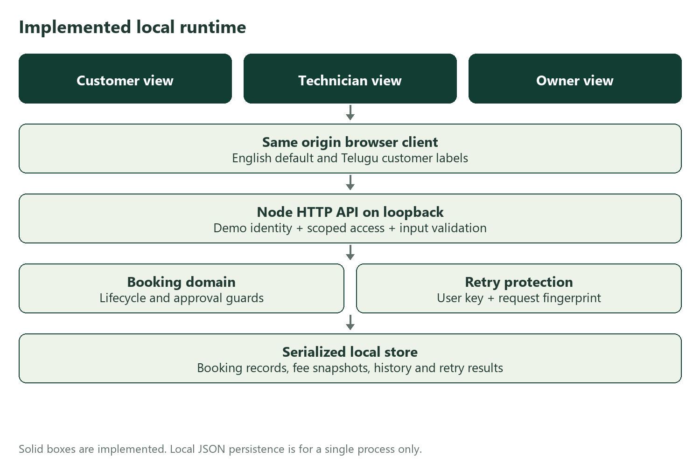
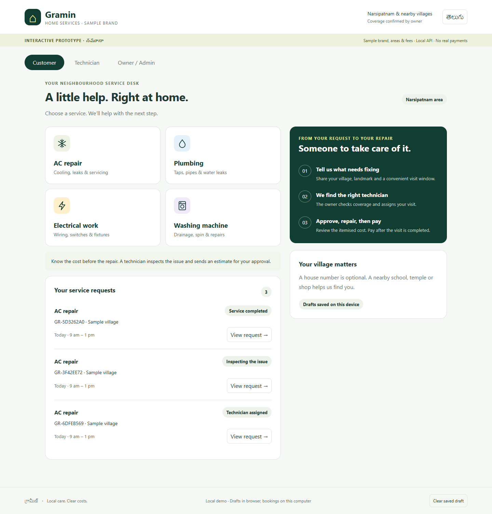
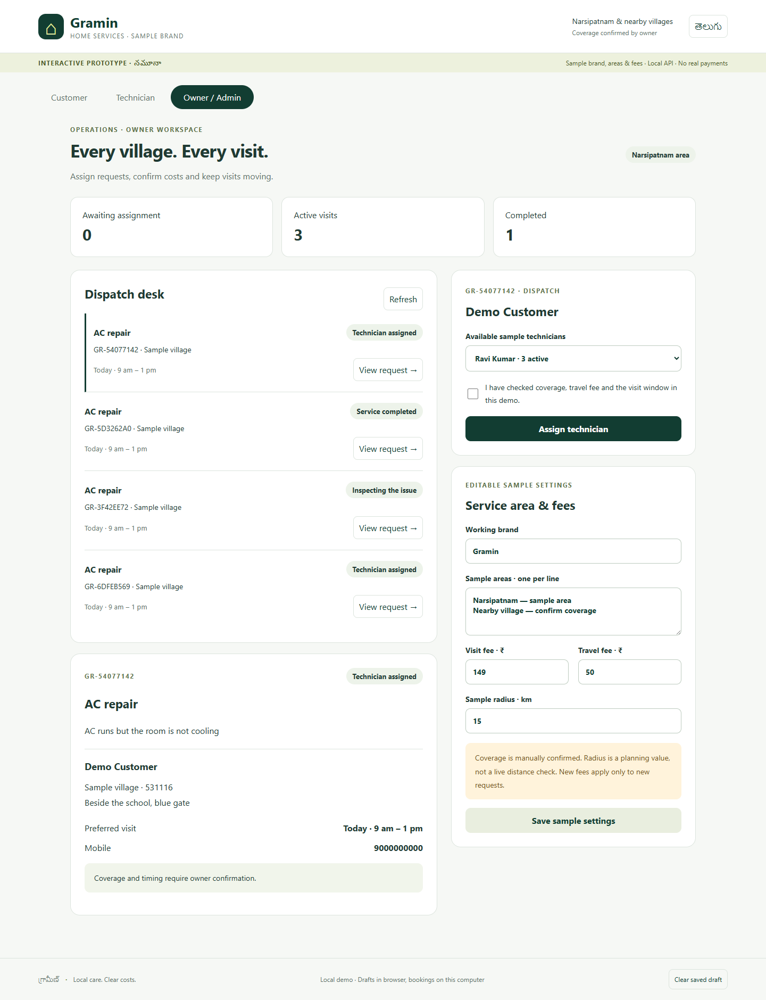
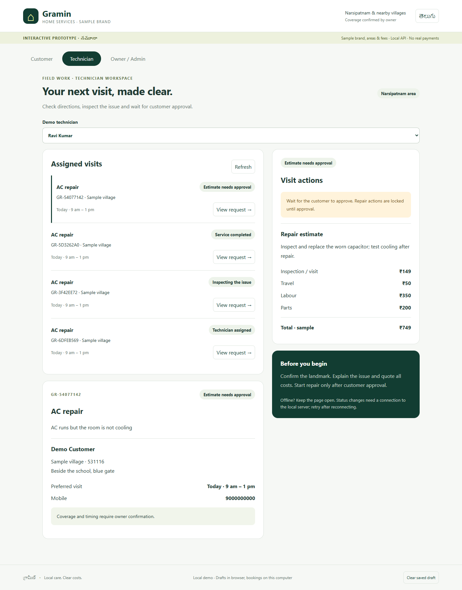
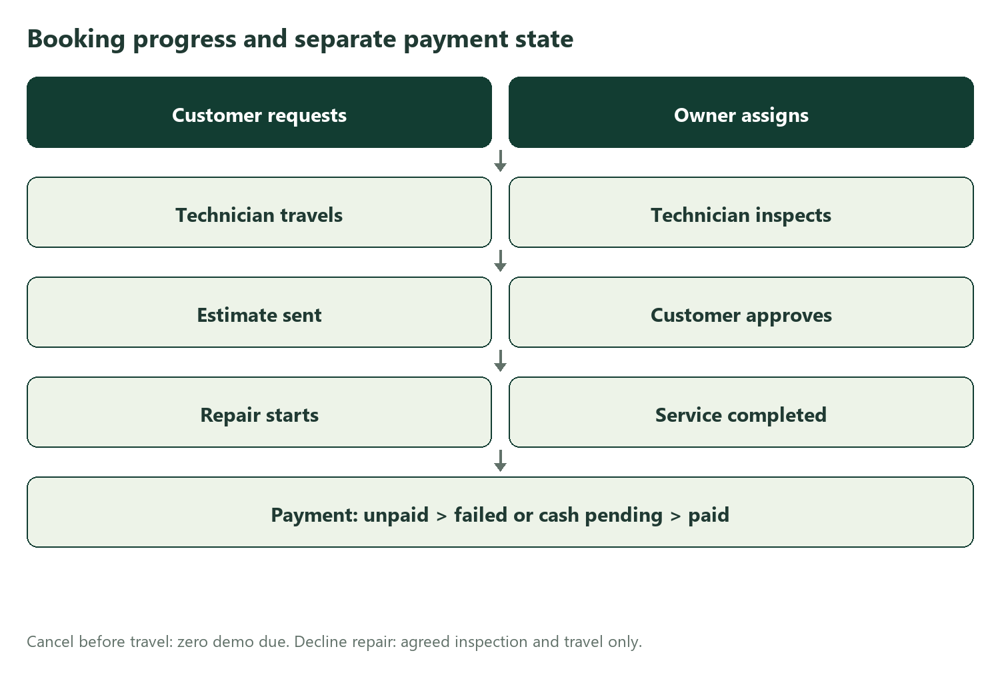
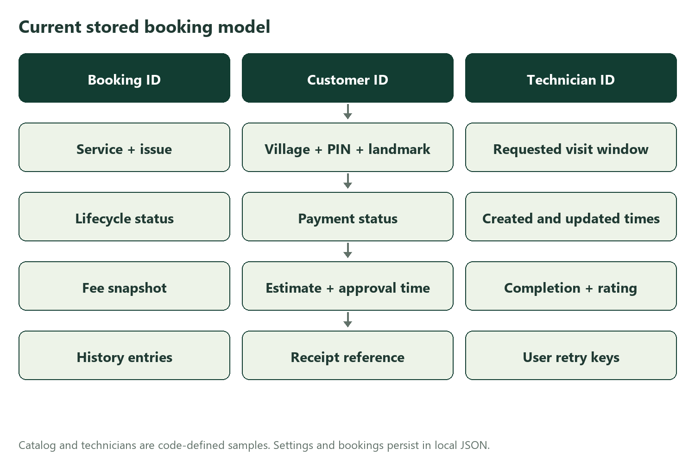
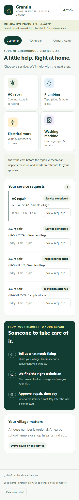
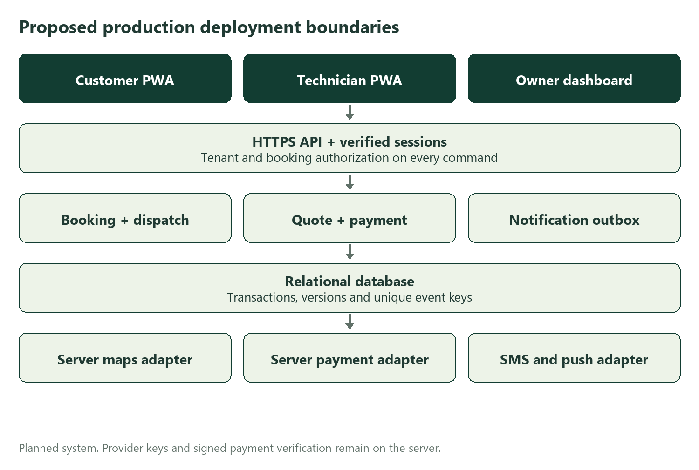

# Gramin app design and architecture

Prepared 16 September 2026 for the business owner and implementation team.

## Purpose and present result

Gramin is a working local prototype for a rural home services business around Narsipatnam. Customers request AC repair, plumbing, electrical work or washing machine repair. The owner assigns a technician, the technician inspects and quotes, the customer approves, and the technician completes the repair before simulated payment. The code now has an actual shared API and persistent local records. It is not deployed or ready for production.

English is the default. The Telugu switch translates the principal customer journey and service labels; admin and technical helper text still need a complete Telugu translation and native-speaker review. Gramin is an editable sample brand. No village list, service radius, technician identities or fees are verified business commitments.

## Location decision

India Post lists Narsipatnam as 531116 and Makavarapalem as 531113. The spoken PIN 531113 therefore needs confirmation against the intended business base. Customers enter their own village and PIN; the app does not force the hub PIN onto every address. Source checked 16 September 2026: https://www.indiapost.gov.in/Financial/DOP_PDFFiles/PostOfficesOnline.pdf

## Implemented local architecture

The browser serves all three role views from dist/index.html, dist/style.css and dist/app.js. It calls GET /api/state and POST /api/actions on the same origin. server.mjs binds to 127.0.0.1:4173 and maps explicit demo bearer tokens to a fixed customer, owner or sample technician. These public demo identities are for review only, not secure authentication.

backend/domain.mjs validates inputs, ownership, assigned-technician access, service skill matching, allowed transitions and retry keys. backend/store.mjs serializes mutations through one process, reloads current state, and writes a temporary JSON file before rename. data/demo.json contains bookings, fee settings, histories and idempotency records. This provides local persistence, not a database suitable for multiple servers. No files under data are served by the static file handler.

backend/adapters.mjs declares maps, payment and notification provider seams. These are mock contracts only and are not wired to live providers. The current ETA is entered by a technician and the payment state is simulated directly in the domain. SMS, push, GPS, real UPI, webhooks and support messaging are not implemented.

## Customer experience

The customer chooses one of four services, enters name, mobile, village, PIN, landmark and the issue, then chooses a preferred visit window. Required fields are validated. Form details are saved on the device; a saved draft is not a submitted request. The review step discloses the sample inspection and travel fee and requires consent before creating a demo booking.

The request appears in the customer list. Status is read from the shared API, with a last-update time and explicit Refresh action. The estimate separates inspection, travel, labour and parts. Only the owning customer can approve or decline. A completed visit supports simulated UPI success, failed-payment retry, cash collection and a rating. An unpaid completed booking stays completed: payment has its own status.

## Owner dispatch experience

The owner sees all demo requests and counts of unassigned, active and completed work. Selecting a booking shows village, directions, issue, phone and requested window. Assignment is limited to sample technicians with the required skill. The owner checks coverage and timing manually before assigning. Active-job counts help review workload, but no capacity scheduler or conflict detector exists yet.

Brand, sample areas, visit fee, travel fee and planning radius are editable. Fees are copied onto a booking at creation; later changes apply only to new requests. The radius is not a distance calculation. Changes to travel charges on an existing job would require a new customer-approved quote in production; this prototype intentionally has no such silent update.

## Technician experience

Each sample technician sees only assigned jobs. The workflow is start journey with a manually entered ETA, arrive, inspect, submit an itemised estimate, wait for customer approval, start repair, and add completion notes. The API rejects attempts to start before approval. If the customer chooses cash, the assigned technician confirms simulated collection. The demo role selector makes these identities reviewable; production must remove it and use authenticated sessions.

## Booking lifecycle and money

The normal progression is requested, assigned, en_route, inspecting, awaiting_approval, approved, repairing and completed. Customers can cancel only while requested or assigned. Cancelling before travel carries zero demo amount due. Declining an estimate ends the repair and leaves only the explicitly accepted inspection and travel fees due. Requests after travel need a real support and cancellation policy, not an unguarded cancel button.

Payment states are unpaid, failed, cash_pending and paid. Sample defaults are INR 149 inspection, INR 50 travel, INR 350 labour and INR 200 parts in the review journey, totalling INR 749. These are examples, not actual prices. Approval freezes the current quote because the prototype has no edit-after-approval action. Real quote revisions need versioning, an approval record and a new customer decision.

## Persistent model and API contract

The local model stores a booking ID, customer ID, service, address fields, phone, issue, requested slot, technician ID, lifecycle status, separate payment status, fee snapshot, estimate, timestamps, completion notes, optional receipt and rating, and event history. Settings and retry records share the local file. Service and technician catalogs are code-defined samples.

GET /api/state returns only the active role's accessible bookings, plus catalog and sample settings. POST /api/actions accepts action and input JSON, an Authorization demo token and an Idempotency-Key header. Supported actions are create, assign, depart, arrive, estimate, approve, decline, start, complete, cancel, pay, cash_received, rate and settings. Payload size is bounded at the API. Browser content is escaped before insertion.

A retry key is scoped to the acting user and tied to the exact action and payload. Replaying the same key returns the original result. Reusing a key for another payload is rejected. The browser preserves a pending key across transport failure; reconnecting and retrying the unchanged request avoids duplicate creation. The API checks the latest state inside a serialized write. This is a single-process guarantee only. Production requires a database transaction, unique key constraints, bounded key retention and concurrency controls.

## Rural operation and accessibility

Village and landmark are required; a formal house number is not required. Every village needs owner-confirmed coverage. Travel fees and visit windows must be explained before dispatch. Large service cards, readable text, visible labels and mobile layouts reduce input difficulty. The customer journey has an optional Telugu mode, with further translation required for full parity.

Browser draft storage works after the form loads. Server mutations require connectivity. The prototype has no service worker, background sync, offline map or queued technician updates. On connection failure it shows a retry message rather than a false success. Production should cache the app shell, queue permitted actions with stable retry keys, mark pending updates, resolve conflicts on reconnect, and show when technician tracking is stale.

On shared phones, local drafts may contain address and contact details. The Clear saved draft action removes them. Production needs session expiry, data minimisation, encrypted transport, retention rules, and explicit consent for precise location and service communications. Voice entry, real phone support and assisted owner booking remain planned.

## Production architecture and access boundaries

Deploy a responsive web app or PWA over HTTPS, with a shared server API and relational database. Replace demo tokens with server-verified identity and sessions. Customer access is restricted by customer_id; technician access by assigned technician_id; owner access is restricted to the business tenant. Every command is checked server-side. Use database transactions and optimistic versions to protect dispatch, quote approval and payment reconciliation.

A proposed relational design has users, technician_profiles, service_catalog, coverage_zones, bookings, booking_events, estimate_versions, payment_attempts and notification_outbox. Store amounts as integer paise, timestamps in UTC and render local visit time explicitly. Use foreign keys, tenant keys, audit actor IDs and unique provider event IDs. Local JSON is replaced rather than shared across replicas.

Keep map, SMS and payment credentials on the server. A maps adapter calculates coverage distance and ETA; technician location updates need consent, scoped visibility and retention limits. An SMS or push adapter consumes a durable outbox with retries. A payment adapter creates provider payment orders and verifies signed webhook events server-side. Browser success alone must never mark a live payment paid. Store each provider event ID uniquely, verify amount, currency, order and merchant, then update payment state transactionally. Duplicate and out-of-order events must not double-charge or reverse settled state accidentally.

## Implementation status

Implemented: three browser role views, shared API, disk persistence, booking visibility checks, transition guards, skill-aware assignment, customer approval, fee snapshots, completion notes, rating, local draft storage and idempotency.

Demo: fixed identities, technician names, fees and areas, relative visit-window labels, technician-entered ETA, simulated UPI results, cash confirmation and sample receipts. These must not be mistaken for real authentication, geolocation, payments or tax invoices.

Planned: production identity, relational database and migrations, scheduling and conflict detection, distance-based coverage, GPS, SMS and push, signed payment webhooks, reconciliation, refunds, support, audit-grade event store, monitoring, backups, consent and retention, full Telugu localisation and offline sync.

## Validation and review guide

Run node server.mjs and open http://127.0.0.1:4173. The project has no installation dependencies for normal operation. node --check dist/app.js and node --check server.mjs check syntax. node --test tests/workflow.test.mjs runs domain checks. tests/browser.cjs uses the host's bundled Playwright and headless Edge and is an environment-specific QA helper, not an app runtime dependency.

The domain tests cover ownership rejection, owner-only assignment, skill mismatch, approval gating, immutable booking fee snapshots, cancellation, declined-quote fees, cash confirmation, failed payment retry and idempotency conflicts. The browser journey checks request creation, assignment, inspection estimate, customer approval, repair completion and simulated payment, and checks the mobile page for horizontal overflow and browser errors. Captures in this document are actual prototype screens, using sample data. A supported WebMCP context was unavailable, so its optional read-only tool has not been runtime-validated.

For review: create a customer request, assign it as Owner, progress the assigned technician to estimate, approve as Customer, complete as Technician, then simulate payment as Customer. Refresh the current view if another session changes a job. All review data is local and no messages or money are sent.

## Phased delivery roadmap

Phase 1 is complete as a local prototype and architecture foundation. Confirm the hub and PIN, final brand, first villages, service radius, technicians, operating hours, languages and visit, travel, cancellation and warranty policies before production work.

Phase 2 builds authenticated accounts, tenant and booking authorization, a relational schema and migrations, real calendar dates, conflict-aware dispatch, quote versions and a support flow. Exit when integration tests prove cross-user isolation, concurrent booking safety and auditability.

Phase 3 integrates sandbox payment, maps and notifications behind server adapters, adds provider retries and reconciliation, and tests signed webhooks, duplicates, failures, refunds and stale location. Exit when provider failure cannot cause a duplicate charge or a false service update.

Phase 4 adds offline PWA behaviour, full Telugu review, device and network testing, accessibility review, monitoring, backups and restore drills. Pilot with a small owner-approved village list and trained technicians. External release remains a separate owner decision; no deployment has been performed.
